<div align="center">

# 🛡️ SAHAARA (ElderGuard)
### *Next-Gen Autonomous AI Safety & Care Coordination Layer for Elderly Care*

[](https://flutter.dev)
[](https://supabase.com)
[](https://pub.dev/packages/get)
[](LICENSE)

<p align="center">
  <b>Sahaara</b> is an intelligent, proactive safety net engineered to protect seniors, empower caregivers, and streamline institutional elder care through automated risk scoring, real-time geofencing, and autonomous multi-tier emergency escalation.
</p>

---

</div>

## 🌟 Key Features & Highlights

```
                          ┌──────────────────────────┐
                          │   SAHAARA RISK ENGINE    │
                          └─────────────┬────────────┘
                                        │
           ┌────────────────────────────┼────────────────────────────┐
           ▼                            ▼                            ▼
  ┌──────────────────┐        ┌──────────────────┐        ┌──────────────────┐
  │  Vitals & Motion │        │ Geofence Monitor │        │ Check-In System  │
  │  (Heart, SpO2)   │        │ (Safe Boundaries)│        │ (Scheduled Response)
  └────────┬─────────┘        └────────┬─────────┘        └────────┬─────────┘
           │                           │                           │
           └───────────────────────────┼───────────────────────────┘
                                       │
                                       ▼
                         ┌───────────────────────────┐
                         │   COMPUTE RISK SCORE      │
                         │    (0-100 Dynamic Scale)  │
                         └─────────────┬─────────────┘
                                       │
                ┌──────────────────────┴──────────────────────┐
                │                                             │
      Score >= 70 (HIGH/CRITICAL)                 Score < 70 (STABLE)
                │                                             │
                ▼                                             ▼
  ┌───────────────────────────┐                 ┌───────────────────────────┐
  │ Autonomous Escalation     │                 │ Continuous Silent         │
  │ Cascade & Push Alerts     │                 │ Background Monitoring     │
  └───────────────────────────┘                 └───────────────────────────┘
```

### 🧠 1. AI-Driven Risk Scoring Engine
* **Weighted Real-Time Signals**: Computes dynamic risk scores (0–100) aggregating vitals anomalies, geofence breaches, missed check-ins, and inactivity patterns.
* **Risk Banding**: Automatically classifies status into **Low (0-29)**, **Moderate (30-69)**, and **High/Critical (70-100)**.
* **Predictive Alerts**: Notifies caregivers before a minor delay turns into an emergency.

### 📍 2. Dynamic Geofencing & Google Maps Live Tracking
* **Custom Safe Zones**: Caregivers can define circular geofences with flexible radii around home, parks, or care centers.
* **Real-Time GPS Sync**: Live senior location updates rendered on custom Google Maps with interactive markers.
* **Instant Breach Detection**: Automatically triggers high-priority alerts when safe boundaries are crossed.

### ⚡ 3. Autonomous Escalation System
* **Multi-Tier Cascade**:
  * **Level 1**: Direct push notification & in-app prompt to Senior.
  * **Level 2**: Immediate alert dispatch to primary Caregivers & Family Circle.
  * **Level 3**: Escalation to Emergency Contacts & Institution Administration.
* **One-Tap Resolution**: Caregivers can mark seniors safe or manually escalate with a single tap.

### 💊 4. Smart Medication & Vitals Tracking
* **Medication Schedules**: Timed dose reminders with confirmation tracking and missed-dose alerts.
* **Vitals Monitoring**: Log and visualize heart rate (BPM) and SpO2 trends over time.

### 📱 5. Role-Tailored Interface Experiences
* **Care Receiver (Senior Mode)**: Senior-friendly layout with large touch targets, bold high-contrast text, simplified task schedules, and a single-press SOS button.
* **Caregiver / Family Dashboard**: Multi-senior dashboard showing live location, current risk score chips, activity timelines, and direct messaging.
* **Institution Dashboard**: Administrative view built for care homes and medical institutions overseeing multiple senior profiles concurrently.

---

## 🏗️ Architecture & Project Structure

The codebase is built following clean **GetX (Model-View-Controller/Repository)** architecture in Flutter:

```
lib/
├── app/
│   ├── core/
│   │   ├── constants/       # App-wide color palettes and constants
│   │   ├── env/             # Environment variable management & fallbacks
│   │   └── widgets/         # Shared UI components (RiskStatusChip, etc.)
│   ├── data/
│   │   ├── models/          # Strongly-typed models (ProfileModel, CheckInModel, etc.)
│   │   └── services/        # SupabaseService, NotificationService, CloudinaryService
│   ├── modules/             # Modular GetX Feature Modules
│   │   ├── auth/            # Authentication & Onboarding
│   │   ├── caregiver_dashboard/ # Caregiver overview & patient cards
│   │   ├── check_in/        # Safety check-in prompts & logs
│   │   ├── geofencing/      # Live maps & zone configurations
│   │   ├── incidents/       # Escalation details & incident resolution
│   │   ├── medication/      # Pill reminders & schedules
│   │   ├── risk_dashboard/  # Risk score breakdown & analytics
│   │   ├── safety_timeline/ # Chronological safety log
│   │   ├── senior_profile/  # Senior profile management
│   │   └── vitals/          # Heart rate & SpO2 panels
│   ├── routes/              # AppPages & AppRoutes definitions
│   └── utils/               # Helper methods & formatters
└── main.dart                # Application entry point
```

---

## 🛠️ Tech Stack & Dependencies

| Category | Technology |
|---|---|
| **Framework** | [Flutter 3.x](https://flutter.dev) (Dart) |
| **State & Navigation** | [GetX](https://pub.dev/packages/get) |
| **Backend & Realtime** | [Supabase](https://supabase.com) (PostgreSQL, Auth, Edge Functions) |
| **Maps & Location** | [Google Maps Flutter](https://pub.dev/packages/google_maps_flutter) & [Geolocator](https://pub.dev/packages/geolocator) |
| **Storage & Assets** | [Cloudinary](https://cloudinary.com) |
| **Notifications** | [Flutter Local Notifications](https://pub.dev/packages/flutter_local_notifications) |

---

## 🚀 Quick Start & Setup Guide

### Prerequisites
* [Flutter SDK](https://flutter.dev/docs/get-started/install) (`v3.19.0` or higher)
* [Android Studio](https://developer.android.com/studio) or VS Code with Flutter extension
* Android Device or Emulator (`API 21+`)

### 1. Clone the Repository
```bash
git clone https://github.com/your-org/sahaara.git
cd sahaara
```

### 2. Install Dependencies
```bash
flutter pub get
```

### 3. Setup Credentials & Configuration
Create a `.env` file in the root directory (or populate `lib/app/utils/constants.dart` & `android/app/src/main/res/values/secrets.xml`):

```env
SUPABASE_URL=https://your-supabase-project.supabase.co
SUPABASE_ANON_KEY=your-supabase-anon-key
GOOGLE_MAPS_API_KEY=your-google-maps-api-key
CLOUDINARY_CLOUD_NAME=your-cloudinary-cloud-name
CLOUDINARY_UPLOAD_PRESET=your-cloudinary-upload-preset
```

> [!IMPORTANT]
> Ensure `android/app/src/main/res/values/secrets.xml` contains your Google Maps API key for Android builds:
> ```xml
> <?xml version="1.0" encoding="utf-8"?>
> <resources>
>     <string name="google_maps_api_key">YOUR_API_KEY_HERE</string>
> </resources>
> ```

### 4. Run the Application
```bash
flutter run
```


---
## 📸 Screenshots

<div align="center"> 
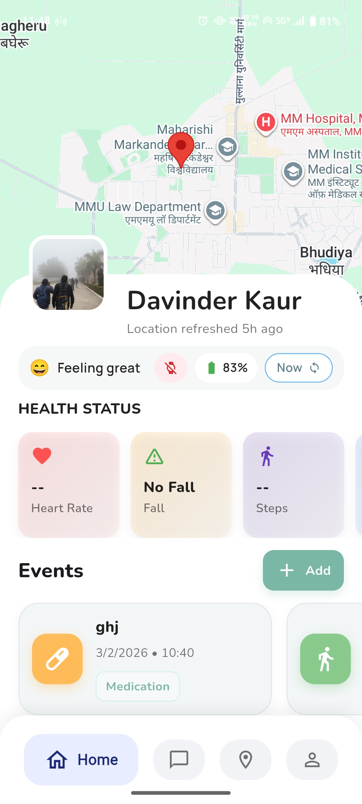 
 
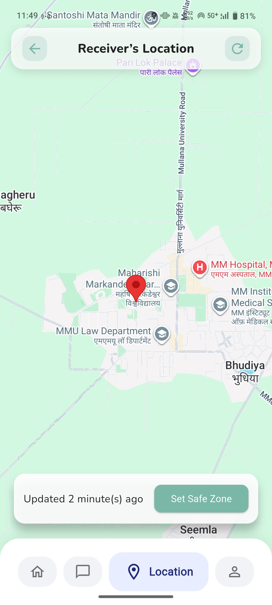 
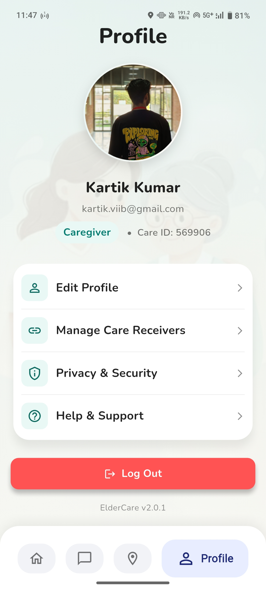 

<br><br>

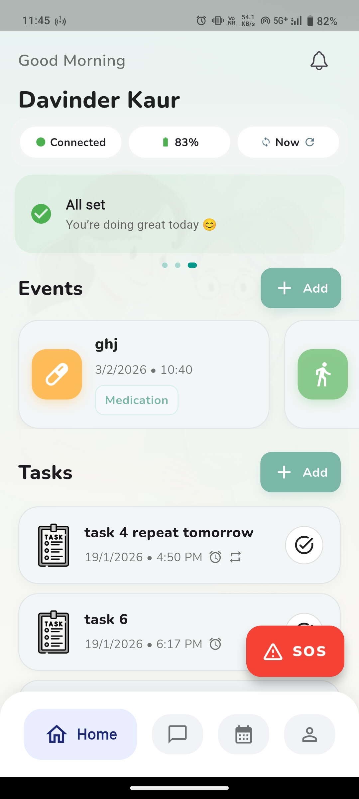 
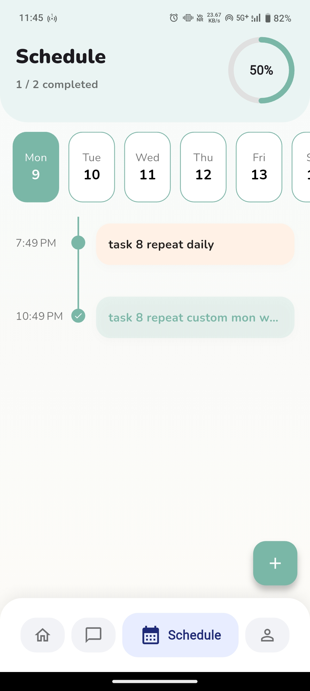
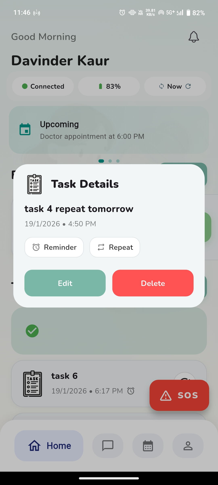 
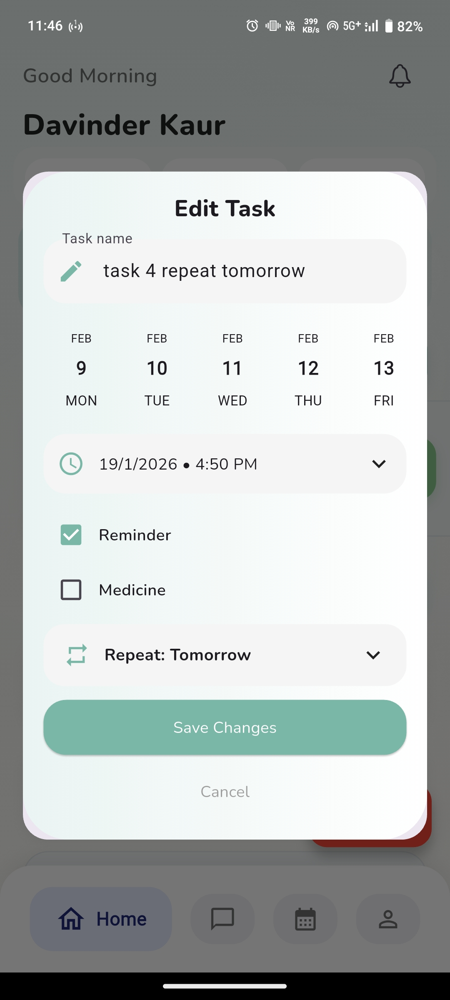 

<br><br>

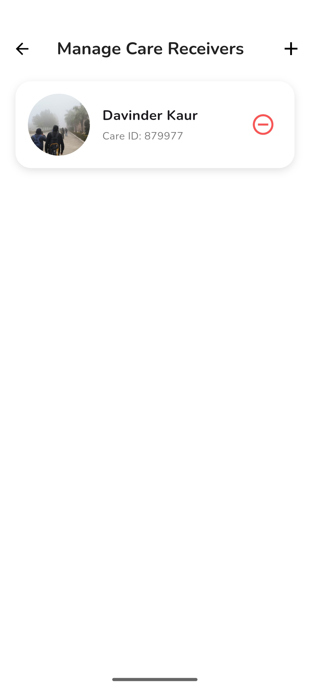 

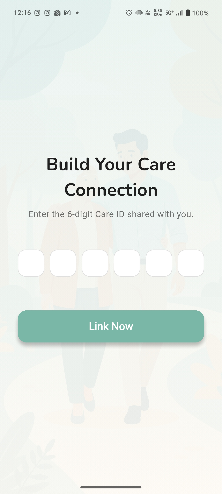 
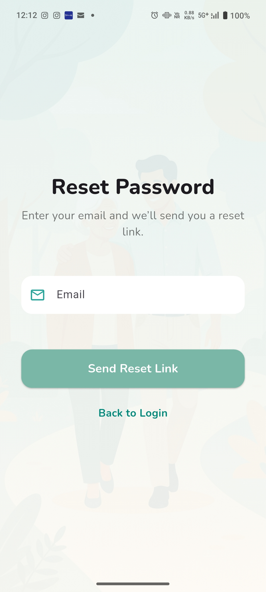

<br><br>

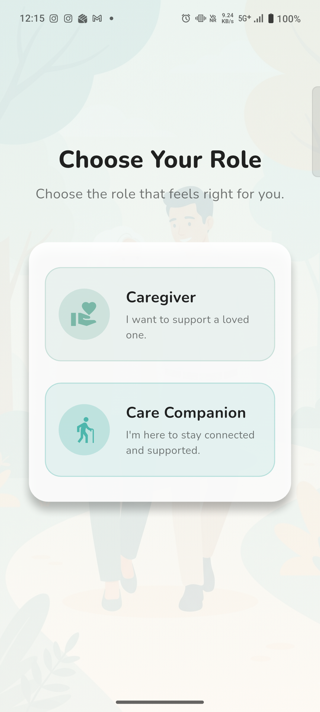 
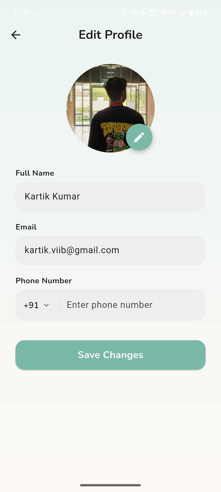
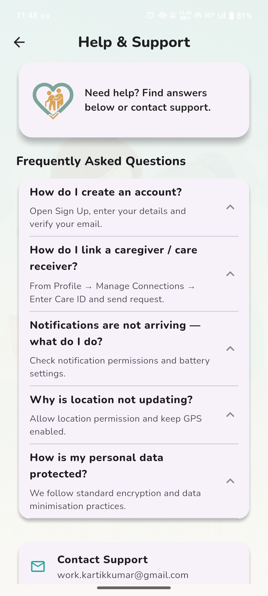 
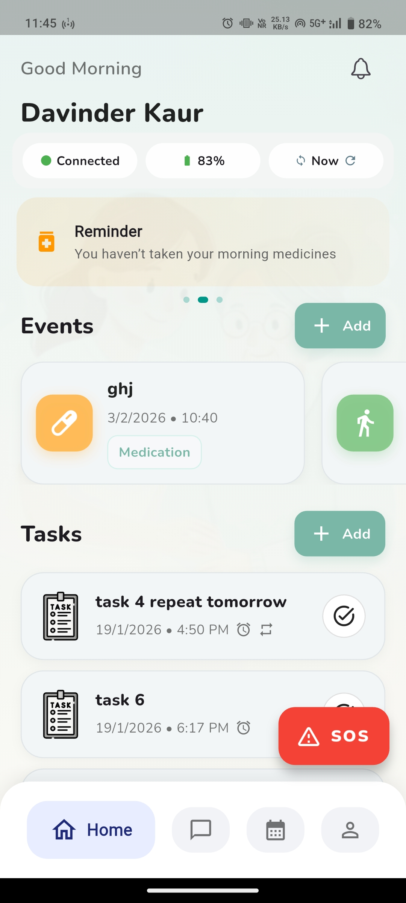 

<br><br>


</div>

---
## 🔒 Security & Privacy

* **Row Level Security (RLS)**: Supabase PostgreSQL tables strictly restrict data access between Seniors, linked Caregivers, and authorized Institution Admins.
* **Encrypted Keys**: Sensitive keys, secrets, and `.env` configuration files are ignored by version control via `.gitignore`.

---

## 🤝 Contributing

Contributions, issues, and feature requests are welcome! Feel free to check out the [issues page](https://github.com/your-org/sahaara/issues).

---

<div align="center">

Made with ❤️ to keep our seniors safe & connected.

</div>
